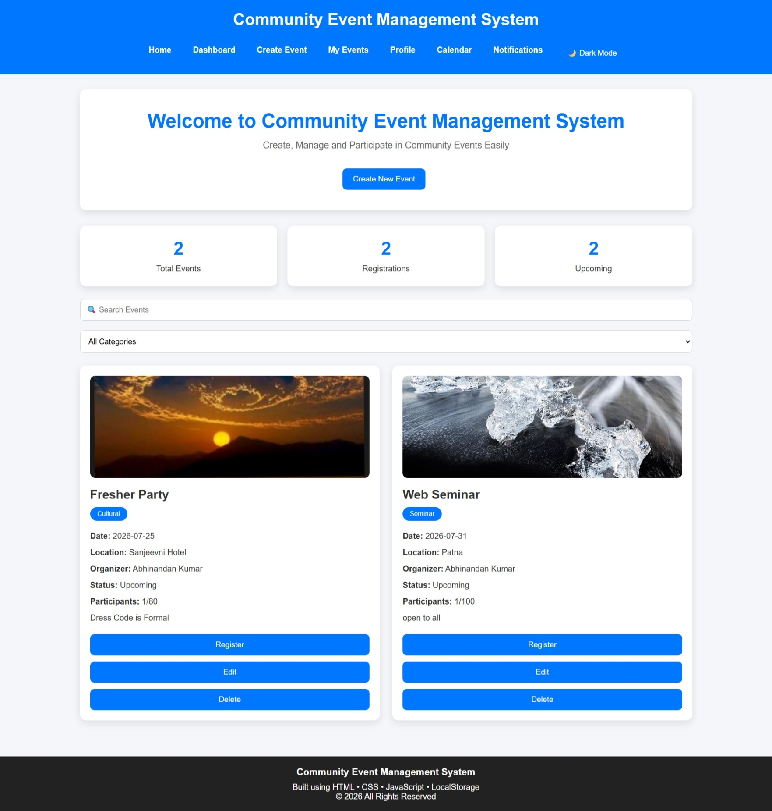
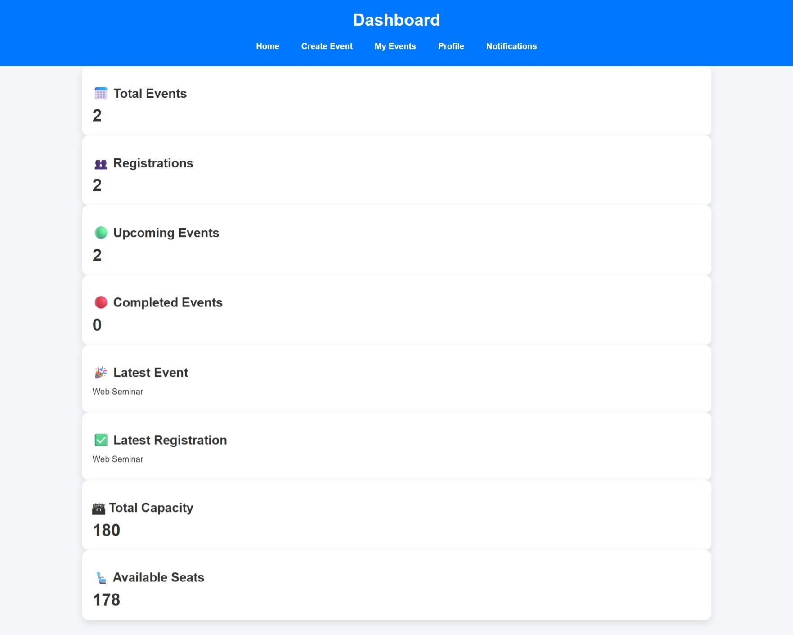
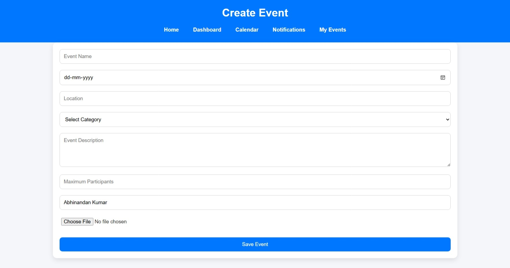
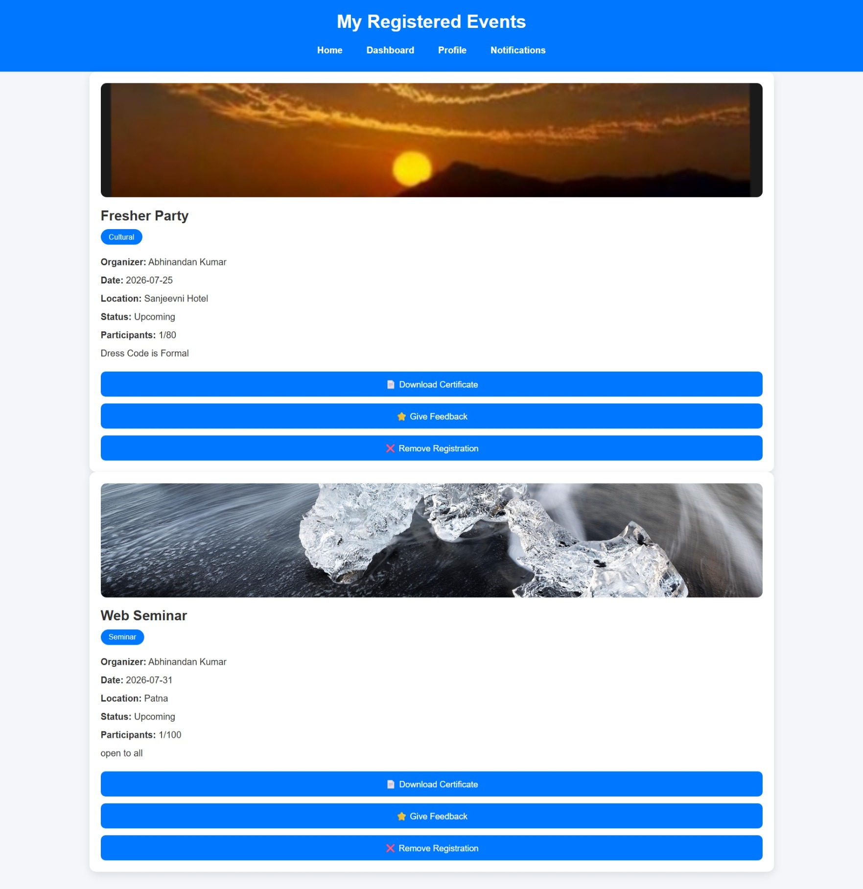
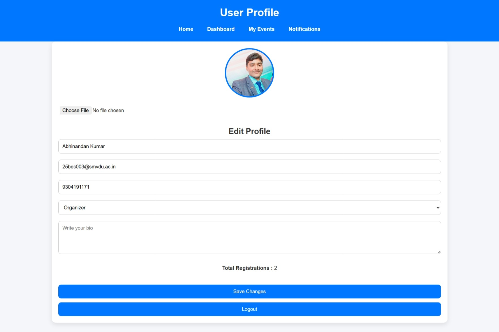
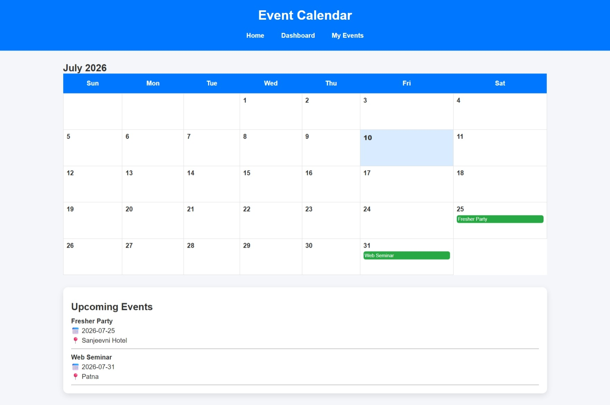
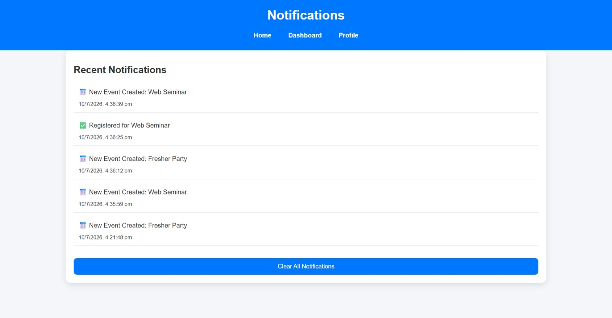
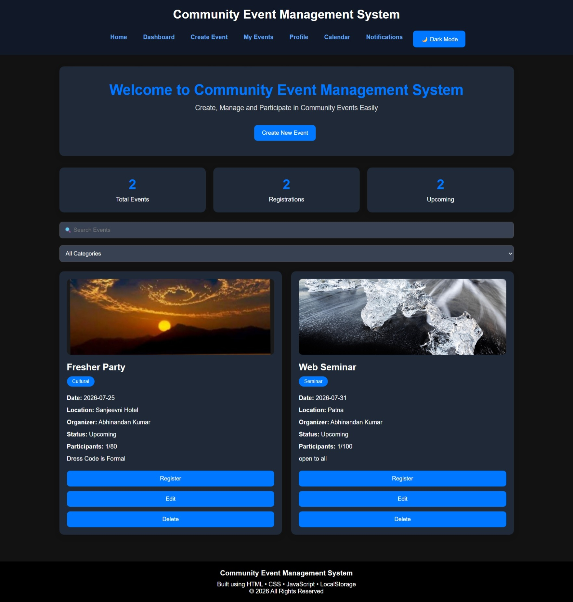

# 🎉 Community Event Management System

A responsive web application developed using **HTML, CSS, JavaScript, and LocalStorage** that allows users to create, manage, register for, and participate in community events.

---

## 📖 Project Overview

The Community Event Management System is a front-end web application that enables users to:

- Register and Login
- Create and Manage Events
- Register for Events
- View Registered Events
- Download Participation Certificates
- Submit Feedback and Ratings
- Receive Notifications
- View Events in Calendar
- Manage User Profile
- Switch Between Light and Dark Mode

All application data is stored locally using **LocalStorage**, making the project simple, fast, and database-free.

---

## ✨ Features

### 👤 User Authentication
- User Registration
- Secure Login
- Logout

### 📅 Event Management
- Create New Events
- Edit Existing Events
- Delete Events
- Search Events
- Filter Events by Category

### 🎟 Event Registration
- Register for Events
- Cancel Registration
- View Registered Events

### 👨‍💻 User Profile
- Edit Profile
- Upload Profile Picture

### ⭐ Feedback System
- Give Ratings
- Submit Feedback
- View Previous Feedback

### 📄 Certificate Generation
- Download Participation Certificate as PDF

### 🔔 Notifications
- Event Creation Notifications
- Registration Notifications
- Registration Cancellation Notifications

### 📆 Calendar
- View Upcoming Events

### 🌙 UI Features
- Responsive Design
- Dark Mode Support

---

## 🛠 Technologies Used

- HTML5
- CSS3
- JavaScript (ES6)
- LocalStorage
- jsPDF Library
- Git
- GitHub

---

## 📂 Project Structure

```
Community-Event-Management-System
│
├── index.html
├── login.html
├── register.html
├── profile.html
├── dashboard.html
├── create-event.html
├── my-events.html
├── feedback.html
├── calendar.html
├── notifications.html
│
├── css
│   └── style.css
│
├── js
│   └── app.js
│
├── images
│   ├── home.png
│   ├── dashboard.png
│   ├── create-event.png
│   ├── my-events.png
│   ├── profile.png
│   ├── calendar.png
│   ├── notifications.png
│   └── dark-mode.png
│
└── README.md
```

---

## 📸 Screenshots

### 🏠 Home Page



---

### 📊 Dashboard



---

### ➕ Create Event



---

### 🎟 My Events



---

### 👤 Profile



---

### 📆 Calendar



---

### 🔔 Notifications



---

### 🌙 Dark Mode



---

## ▶️ How to Run

1. Download or clone this repository.

```
git clone https://github.com/abhii131/community-event-management-system.git
```

2. Open the project folder in **Visual Studio Code**.

3. Install the **Live Server** extension (optional).

4. Open **index.html**.

5. Click **Open with Live Server**.

Or simply open **index.html** in your browser.

---

## 💾 Data Storage

This project stores data using **Browser LocalStorage**.

The following information is stored:

- User Information
- Events
- Registered Events
- Notifications
- Feedback
- Theme Preference

---

## 🚀 Future Enhancements

- Database Integration (MySQL / MongoDB)
- Firebase Authentication
- Email Notifications
- Admin Dashboard
- QR Code Event Registration
- Online Payment Integration
- Event Analytics Dashboard
- Cloud Image Upload

---

## 🎯 Learning Outcomes

This project helped in learning:

- HTML5
- CSS3
- JavaScript DOM Manipulation
- Event Handling
- LocalStorage
- Responsive Web Design
- Git & GitHub
- PDF Generation using jsPDF
- Project Documentation

---

## 👨‍💻 Author

**Abhinandan Kumar**

B.Tech – Electronics & Communication Engineering

Shri Mata Vaishno Devi University (SMVDU)

GitHub: https://github.com/abhii131

Project Repository:
https://github.com/abhii131/community-event-management-system

---

## 📄 License

This project is developed for **educational and internship purposes**.

Feel free to explore and learn from this project.

---

# ⭐ This project was developed as part of my internship to demonstrate front-end web development skills using HTML, CSS, JavaScript, and LocalStorage.